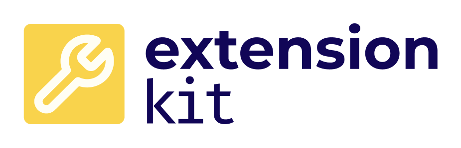

# ExtensionKit

Through kits like AttackKit and DiscoveryKit, Steadybit can be extended with new capabilities. Such *Kit usages are called extensions. ExtensionKit 
contains helpful utilities and best practices for extension authors leveraging the Go programming language.

## Installation

Add the following to your `go.mod` file:

```
go get github.com/steadybit/extension-kit
```
